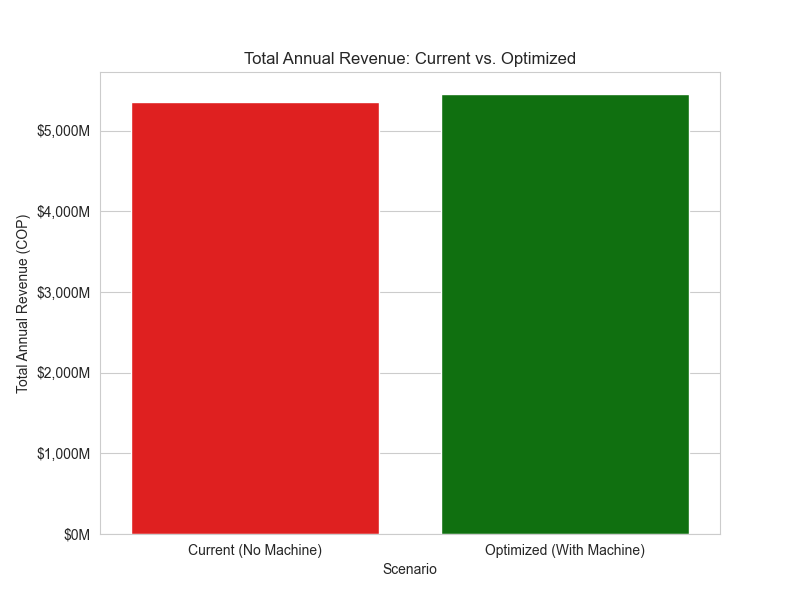

# 🥑 Avocado Sales Optimization: ROI Analysis for Quality Control Technology

## 📌 Executive Summary
This project demonstrates how data-driven decisions solve critical logistics and sales bottlenecks in the Colombian retail sector. By analyzing avocado maturity levels, I identified an annual **revenue leakage of $123,321,900 COP**. Implementing an automated grading solution yields a **Project ROI of 29.27%**, with an investment recovery period of **41 months**.

## 💼 The Business Problem
In Colombia, the Hass avocado market is expanding, but retailers struggle with quality consistency at the point of sale.
* **The Issue:** Customers reject fruit that is too firm (immature) or overripe, leading to "purchase frustration."
* **The Goal:** Quantify the financial impact of "unripe fruit" and evaluate the profitability of a **$150M COP investment** in grading technology.

## 📈 Key Insights from Data
### 1. The "Rejection Threshold"
Statistical analysis reveals that sales rejection spikes dramatically when average maturity drops below **2.5 on a 1-5 scale**. This identifies the exact "danger zone" for inventory management.

  
*Figure 1: Correlation between fruit immaturity and lost sales units.*

### 2. Recovering "Ghost Demand"
Retailers typically only track physical waste (shrinkage). This project tracks **Lost Demand**: the revenue from customers who intended to buy but walked away. By reducing rejection from 15% to 3%, we unlock a previously invisible revenue stream.

  
*Figure 2: Annual Revenue comparison: Current State vs. Optimized Scenario.*

## 💰 Financial Results & ROI
Through Python-based simulations, the following annual metrics were established:
| Metric | Value (COP) |
| :--- | :--- |
| **Annual Avoided Loss (Gross)** | $98,657,520 |
| **Annual Operational Cost** | $54,750,000 |
| **Net Annual Profit** | **$43,907,520** |
| **Initial Investment** | $150,000,000 |
| **Payback Period** | **41 Months** |

## 🛠️ Tech Stack & Methodology
- **Python:** Advanced data simulation (`numpy`), processing (`pandas`), and visualization (`seaborn`/`matplotlib`).
- **Statistical Modeling:** Normal distribution modeling for ripening cycles.
- **Business Intelligence:** Financial modeling for ROI and Payback Period projections.

## 🏁 Conclusion & Recommendation
The investment is **strategically sound**. While the payback period is ~3.4 years, the implementation transforms a recurring quality issue into a measurable competitive advantage. It ensures product-market fit at the shelf level, significantly increasing net profit and customer loyalty.

---
**Contact:** **Helian Fierro** [LinkedIn Profile](https://www.linkedin.com/in/helian-fierro-oyola-143798206/)
