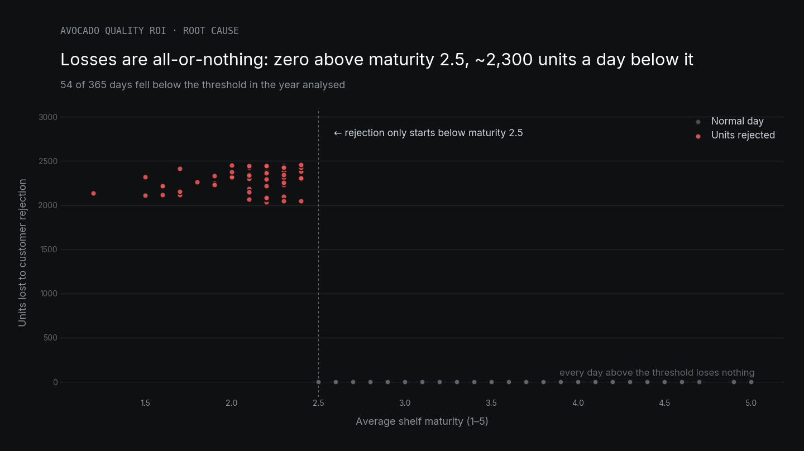
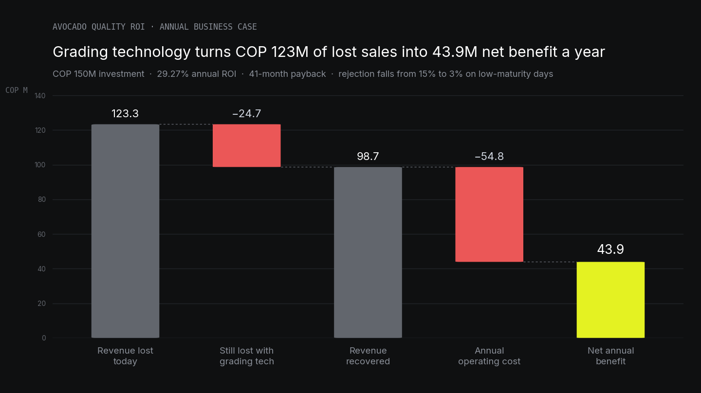
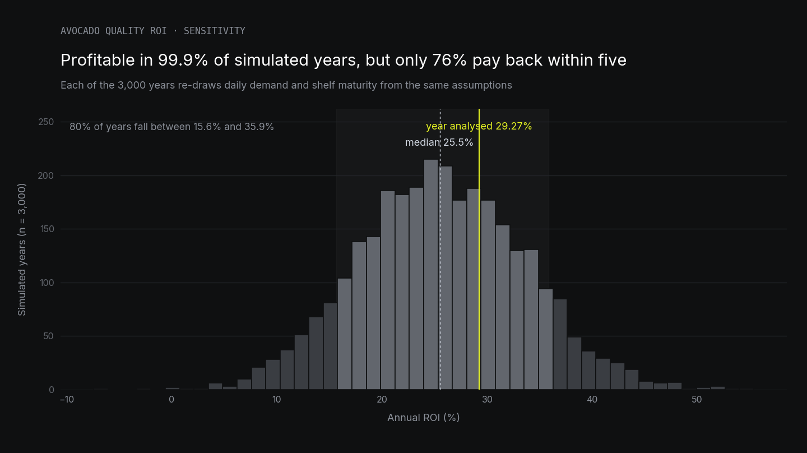

# 🥑 Avocado Quality ROI — pricing the sale you never see

**Does a COP 150M automated grading investment pay for itself?**
Short answer: yes, in 99.9% of simulated years — but only 76% of them pay it back within five.

[](https://colab.research.google.com/github/Helian1505/Avocado_Sales_Optimization/blob/main/Avocado_hass.ipynb)

---

## The problem

A Colombian retail chain loses Hass avocado sales when the fruit on the shelf is too firm.
The shopper picks it up, puts it back, and leaves. That loss never reaches a shrinkage
report, because the fruit was never damaged — the **demand** was. Management could see
waste; it could not see walk-aways, so a COP 150M grading investment had no business case
either way.

## What I did

Modelled a full trading year at day level — demand, average shelf maturity, and the
rejection that follows — then priced the gap between today and a graded scenario, and
stress-tested the result over 3,000 independent years.

## 1. Where the revenue leaks



Rejection is not gradual. It is zero above maturity 2.5 and roughly 2,300 units a day
below it. **54 of 365 days** fell below the threshold in the year analysed, costing
**COP 123,321,900** — 2.25% of annual demand, none of it visible as waste.

That sharp threshold is the whole reason the investment can work: the days worth acting on
are identifiable in advance.

## 2. The business case



The gross saving is not the benefit. Grading does not eliminate rejection — it cuts it from
15% to 3% — and the machine costs COP 150,000 a day to run:

| | COP |
| :--- | ---: |
| Revenue recovered (gross) | 98,657,520 |
| Annual operating cost | −54,750,000 |
| **Net annual benefit** | **43,907,520** |
| Annual ROI | **29.27%** |
| Payback period | **41 months** |

## 3. How much of that is the model, and how much is the year?



Shelf maturity is drawn from a distribution, so a different year has a different number of
low-maturity days — and the whole case moves with it. Reporting a single ROI as a fact
would be the real error in this analysis, so I re-ran the model over 3,000 independent
years:

| | Year analysed | Median | p10 – p90 |
| :--- | ---: | ---: | ---: |
| Revenue lost | 123.3M | 116.3M | 97.7M – 135.7M |
| Net benefit | 43.9M | 38.3M | 23.4M – 53.8M |
| Annual ROI | 29.27% | 25.50% | 15.63% – 35.86% |
| Payback | 41 months | 47 months | 33 – 77 months |

The year analysed sits at the **67th percentile** — a normal draw, not a best case.

## Recommendation

**Make the investment, and size the expectation correctly.** The case is profitable in
99.9% of simulated years, so the risk is not losing money — it is *waiting* for it. Only
~76% of years pay back inside five. If the approval threshold is a five-year payback, this
is a decision under uncertainty and should be presented as a range, not a single number.

**What would change the answer:** the rejection rates (15% today, 3% graded) are
assumptions, not measurements. They move the result more than anything else in the model
and are worth measuring in one store for a quarter before capital is committed.

## Reproducing this

```bash
pip install pandas numpy matplotlib
jupyter notebook Avocado_hass.ipynb   # runs end to end in under a minute
```

**On the dataset:** `data/avocado_simulated_data.csv` is one simulated trading year and it
is the canonical input — every headline figure above is computed from it. The original draw
was made without a random seed, so it cannot be regenerated; it is version-controlled
instead. `simulate_year(seed)` in the notebook produces a different, equally valid year,
which is exactly what section 3 relies on.

## Tech stack

- **Python** — pandas, NumPy for the simulation and the financial model
- **Monte Carlo sensitivity** — 3,000 seeded years, reported as median and p10–p90
- **Matplotlib** — waterfall, threshold scatter and distribution charts

---

**Helian Fierro** · [LinkedIn](https://www.linkedin.com/in/helianfierro/) · [GitHub](https://github.com/Helian1505)
